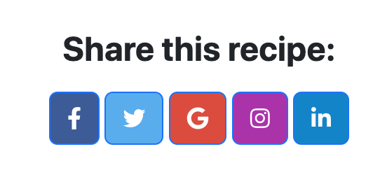
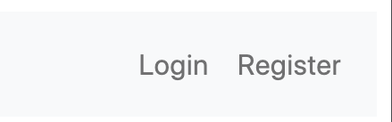

# H's Recipe cards

- Recipe cards is a interactive application for your recipes! Store all your favourite recipes in one place for quick and easy access without having to search through countless recipe books! Create, edit and view all your recipes as well as viewing others on the app. Other users can intereact by liking and commenting, some people might even offer you tips to improve on your own recipes! The target audience of the app is for people who love cooking, sometimes cooking enthusiast's like myself, have recipes scattered through many books and is affective at keeping them all in one place!

## Features 
### Home page
- The home page includes the recipes that all users have created, displayed as cards in a masonry style for a responive design with easy and pleasant viewing. Each card contains a recipe title, the user who created, the date created, a short description and a "view recipe" link to display more recipe details. If the recipe creator has provided an image, the card will also display for an appealing visual to the home page. This also gives the cards different sizes. Each card also shows the amount of likes the recipe has recieved. The cards are set in a row of 3 on large screens and decrease down to row of 1 on smaller devices.

The recipe cards are diplayed like the following example;

#### Navigation
- The navigation bar is featured across all the webs url's. With easy functionality it allows the user to easy navigate around the site, Links include Home, About, Create Recipe, Profile links, Register and Log In, as well as Log Out when user us logged in and a frequently asked questions page. The page link is highlighted to show the user the current page. When the site is loaded on a smaller device the naviagtion is neatly compacted into an interactive burger icon menu.  

#### Footer
- The footer bar is featured across all the webs url's. It includes the social media links to allow the user to keep up to date with the app. With links to Facebook, Twitter, Instagram, Youtube and Linkedin are displayed in a line of icons. When a user hovers over the icons they are changed to a light blue colour. The footer bar also included the sites trademark for copyright purposes.

### Recipe detail page
- The recipe detail page is displayed when the user clicks on the view recipe links on the recipe cards. This page displays everything the user needs for the recipe; title, user created and time, description, method, ingredients, all displayed on a larger card. If an image was provided when the recipe was created it will be set as the background with the card overlaying. Nutritional information, preperation time and amount served are also displayed at the top.

- The recipe card is set out for easy and appealing viewing for the user with the most important information being the center point and the secondary information being smaller. The nutritional information is inline below the title in green circles almost imitating the nutritional information seen on food packages in supermarkets. The amount serve and the prep time are below in red squares, this is so its the first thing the user sees and can determine wether they have enough time to make the recipe or wether they need to increase the quantity for more serving size.

- The card also includes the amount of likes the recipe has recieved, unfortunately the ability to like the recipe will be added soon, as well as a comments box to view other users comments, as well as add your own. This allows users to connect and show interest in others recipes, as well as offer tips on changes or additions to the recipe. I believe this makes the app much more interactive with other users. When a user comments a pop up message will display to show the comment was published successful.

- Also included is quick share buttons to share the recipe on social media sites, Included is Facebook, Twitter, Instagram and Google. This is also good to get more traffic on the web as people can see and sign up to view their friends shared recipe. 

- If the user owns the recipe and are in the recipe detail view they will see update and delete buttons to edit their recipe. Users that dont own the recipe will not be able to access these buttons.

### Create recipe page
- The recipe create page is loaded when the user clicks on the create recipe link on the home page. This allows the user to create a recipe for the app. A simple form is required to fill out. Information like title, description, ingredients and method are required for the from to be submitted. Secondary information such as images, nutritional information, serving amount and prep time are not required if not provided. This form is simple to use and is not over complicated. One the form is submitted the recipe will appear on the home page as well as on your own profile.

### Update/Edit recipe page
- The update recipe page is only able to be loaded when the recipe author is viewing their own recipe, this can be done via an update button. A user or non user viewing the recipe they havent created can not access the update page. The update page is very similar to the create recipe page with the already submitted information included in the text fields. Here the user can add, change and update the recipe. This is very useful if the user finds mistakes in their recipe, want to increase the serving size, or want to add more/take off the recipe. 

### Delete recipe page
- The delete recipe page is also similar to the create and update pages. Similar to the update page, the delete page can only be accessed by the recipe author. Here the user can delete a recipe from the database. This allows the user to delete a recipe that doesnt work or is disliked. Also if the user's account is deleted, all the recipes that user has created will also be deleted.

!

### Sign Up/Register page 
- The sign up page is featured when the user clicks on the register option in the navigation bar. This will take the user to the sign up form which allows the user to create an account. An account must be created in order to interact with the website. The form is simple to use asking for a username, email and a repeat password. The same username cannot be submiited twice, a pop up message will show this if the user already exists. Once the form is submitted the user will be retuned to the home page and is required to log in. The register page is unaccessable when the user is logged in.

!

### Login page
The login page is very similar to the register page in that it can only be accessed when the user is signed out/does not have an account. It also includes a simple form with username and password required. Once the user has logged in the they will be redirected back to the home page. In the navigation bar the user can see their username next to a user icon. When logged in the logout button will display in the nav bar also. Clicking this link will log the user out. The login/logout functionality is simple to use and requires minimal effort so the user can focus on what's more important, the recipes!

### Profile page 
The profile page is useful when the user wants to view just their own recipes. This allows the use to filter out other recipes not created by them so they can focus on only their own. This is helpful for users that want to only view their own. Set up similar to the home page in a masonry style is easy to view.

### FAQ page
The frequently asked page is for users to find out how to do things on the app. Its set up in a accordion style with the boxes able to maximize(when the plus is clicked) to view the answer and minimize (when the minus icon is clicked). Only one box can be opened at once in this section to allow for tidy viewing. Simple and elegant to use, a user can easily find the answer they are looking for. They can even ask the app creator if one of their questions is not shown on the page! When the question is sent the user will see a pop up message to know their message as been recieved.

## Other Features

### Pop up messages 
Various pop up messages are included around the site to tell the user whats happening with their inputs. For example;

!

## Features in future left to impliment
- Like button, didn't manage to create in time, please refer to the user stories.
- Password recovery for registered users. 
- Users having the ability to delete their accounts.
- Users being able to add more to profile (profile image, personal information, bios, etc).
- Display top profiles at top of home page similar to instagram stories, from there users can view top users recipes.
- Most liked recipes appearing at the top on home page.
- Ability to be able to search for particular recipes based on hastags(being able to add drag and drop hashtags in creat recipe form for search).
- The ability to keep special recipes private 

## Testing
- For all testing documentation, Please refer to [TESTING.md](TESTING.md) file.

## Deployment and setting up

### Installing Django, Gunicorn, libraries and Setting up the app;
- In the terminal type the following to install django other packages and setting up the workspace;
>  pip3 install 'django<4' gunicorn

>  pip install --upgrade pip

- After those packages have downloaded install some supporting libraries;
>  pip3 install dj_database_url psycopg2

- Next install cloudinary libraries
>  pip3 install dj3-cloudinary-storage
#### Create a requirements.txt file
>  pip3 freeze --local > requirements.txt
#### Create a project;
>  django-admin startproject django_recipes .
#### Check that the project server is working;
> python3 manage.py runserver
#### Create a new app;
>  manage.py startapp recipes 

- In 'django_recipes/settings.py' add the app (recipes) to the INSTALLED_APPS dictionary.

#### Create first view and url;
- In recipes/views.py import 'HttpResponse package' and create a function that allows a view for the user, for example;

- Create a file in recipes folder called urls.py (so we can work primarily from the app folder) and import views.py from the same file, "from . import views"
- Back in urls.py in django_recipes import the package "include" and create another path - "path('', include('recipes.urls'))" and what this is basically saying is when ever anyone goes to my app website "/" anything go to recipes.urls and use those url paths.
- Create a new url path in recipes/urls.py;
urlpatterns = [
    path('', views.home, name="recipes-home"),
]
- Run server to check it is working! 
> python3 manage.py runserver

#### Create HTML templates 
- Create a 'templates' folder in 'recipes' folder, create another folder called 'recipes' in 'templates', and then in that, create a file called 'home.html'.
- In views.py add to the 'home' function - "return render(request, "recipes/home.html")" and delete the return of the HttpResponse. 

#### Pass some data into the templates
- Create some dummy recipes dictionary called 'recipes' in views.py for some context.
- Define a variable called context within the home function and pass the recipes data into it creating an object;
context = {
    'recipes': recipes
  }
- Pass the context variable into the return render statement.
- Using logic, create and end a loop to go through the 'recipe' object to pull data;

{{recipe.title}}
{{recipe.author}} | {{recipe.date_posted}}
{{recipe.content}}


#### Create a Base file for the same content across all of the app pages
- Create a file called base.html in the recipes/templates/recipes file
- Insert boilerplate html into file and in the body insrt block content and endblock tags; 
 
- In home.html file clear out all html, head and body tags and at top add -  and add the block content and end block tags.
- All page content goes in between these tags.

### Adding bootstrap 
- Head to the bootstrap website and to the 'get started' section.
- In the intoduction section part 2, copy and paste the link tag and add into the head tags of base.html.
- Copy and paste the JavaScript script tags and add to bottom of the body tags in base.html.

### Setting up admin
In the terminal;
> python manage.py migrate

> python3 manage.py createsuperuser

- Create a username and password. 
- Type /admin on the end of the browser url to access the admin.

### Creating the model
- Create a recipes model in the recipes/models.py file.
- Make the migrations to update the database, in the terminal run:
> python manage.py makemigrations

> python manage.py migrate
- In order to see the model in the admin it has to be registered in recipes/admin.py, add;
'from . import models'
'admin.site.register(models.Recipe)'
- Run the server, head back to ""/admin, login and add some recipes.
- To use this real data in our template, update the recipes/views.py file home view to query the database.

## Deployment

### Setting up the database
- Log in to ElephantSQL.com to access your dashboard.
- Click “Create New Instance”.
- Set up your plan.
- Select “Select Region” and select a data center near you then click "Review".
- Check your details are correct and then click “Create instance”.
- Return to the ElephantSQL dashboard and click on the database instance name for this project
- In the URL section, click the copy icon to copy the database URL

### Deloyment to Heroku
- Create new Heroku App.
- Add Database to App Resources located in the Resources Tab.
- Copy DATABASE_URL value and add to key in config vars section.
#### Create new env.py file on top level directory
- In the new env.py file import "os" libary.
- Set the environment variables.
`os.environ["DATABASE_URL"]` = * your Heroku DATABASE_URL Link *
`os.environ["SECRET_KEY"]` = * Make up your own randomSecretKey *
#### Back in Heroku 
- Add your secret key to the config vars section.
- Add the key "PORT" and the value "8000" also.
#### Prepare our environment and settings.py file
- In settings.py add the following to top of file;
`import os`
`import dj_database_url`

`if os.path.isfile("env.py"):`
   `import env`
- Remove the insecure secret key and replace with `os.environ.get('SECRET_KEY')` to link with the variable on Heroku.
- Comment out the old DataBases Section.
- Add the follwing new DATABASES Section to link to the DATATBASE_URL variable on Heroku;
`DATABASES = {`
   `'default': dj_database_url.parse(os.environ.get("DATABASE_URL"))`
`}`
- Save all files and Make Migrations. In the terminal type;
> python3 manage.py migrate

### Connect Cloudinary
- Create a static file in main directory 
#### Create a Cloudinary account 
- Create a cloudinary account to store static and media files https://cloudinary.com/.
-  In cloudinary.com copy the CLOUDINARY_URL from the dashboard.
#### In envy.py
- Add Cloudinary URL to env.py 
`os.environ["CLOUDINARY_URL"]` = *cloudinary url*
#### In Heroku
- Add Cloudinary URL to Heroku Config Vars;
Key = COUDINARY_URL, Value = *cloudinary url*
- Add DIABLED_COLLECTSTATIC to Heroku Config Vars;
Key = DISABLE_COLLECTSTATIC, Value = 1
#### In settings.py
- Add Cloudinary Libraries to installed apps (order is important);
`INSTALLED_APPS = [`
    `…,`
    `'cloudinary_storage',`
    `'django.contrib.staticfiles',`
    `'cloudinary',`
    `…,`
`]`
- Tell Django to use Cloudinary to store media and static files. Under `STATIC_URL = '/static/'` in settings.py add;
`STATICFILES_STORAGE = 'cloudinary_storage.storage.StaticHashedCloudinaryStorage'`
`STATICFILES_DIRS = [os.path.join(BASE_DIR, 'static')]`
`STATIC_ROOT = os.path.join(BASE_DIR, 'staticfiles')`

`MEDIA_URL = '/media/'`
`DEFAULT_FILE_STORAGE = 'cloudinary_storage.storage.MediaCloudinaryStorage'`
- Add Heroku Hostname to ALLOWED_HOSTS
`ALLOWED_HOSTS = ["h-recipe-cards.herokuapp.com", "localhost"]`
### Main deployment
- Create Procfile on the top level directory.
- In Procfile, add code `web: gunicorn django_recipes.wsgi`.
#### Push for deployment
In the terminal;
> git add . 

> git commit -m “Deployment Commit”

> git push

- Deploy Content manually through Heroku
- Recipes app should be up and running!

### Local Deployment

In order to make a local copy of this project, you can clone it. In your IDE Terminal, type the following command to clone my repository:

- `git clone https://github.com/henrysevern/django_recipe_app.git`

Alternatively, if using Gitpod, you can click below to create your own workspace using this repository.

# Sources
- Fellow slack students for advive 
- Tutor and mentor support
- Nav Bar - Bootstrap 
- Crispy Forms - https://django-crispy-forms.readthedocs.io/en/latest/index.html
- Masonary style cards - https://getbootstrap.com/docs/5.2/examples/masonry/

 ### Media

- All images were imported from Pexel.