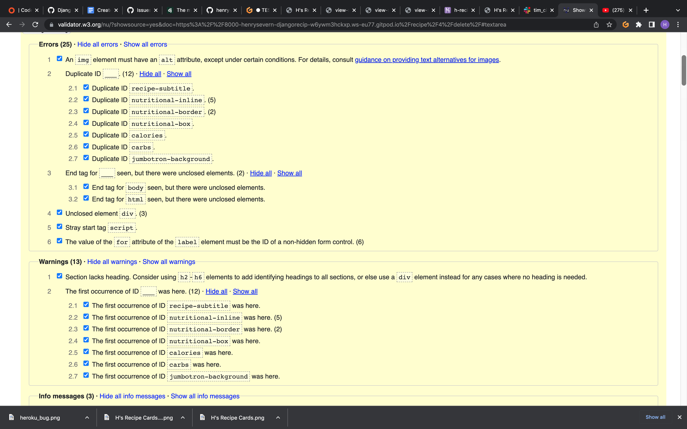

# Code Validation 
## HTML Validation 
All code for `HTML` has been validated through validator.w3, validated by URI

### Bugs/Code I couldn't fix for validation 

- Script tag error on all pages shown as a stray `script` tag on line 141.
- `What I've done to try and fix` - Checked base.html and couldnt find a stray tag.
- Register page as a `ul` error on line 71.
- `What I've done to try and fix` - Error is within crispy form so I cannot access it.

### Recipes Pages

> home.html

No additional errors on this template.

> questions.html

No additional errors on this template.

> delete.html

No additional errors on this template.

> detail.html

Many errors on this template 
- Repeat `id` attributes, now changed to `class` attributes.
- Unclosed `div` tags.
- Changed the `label` elements to `span` and removed `id` attributes not being used anymore

> create.html

No additional errors on this template.

> login.html

No additional errors on this template.

> logout.html

No additional errors on this template.

> profile.html

No additional errors on this template.

> register.html

No additional errors on this template.

> update.html

No additional errors on this template.

## CSS Validation 
All code for `CSS` has been validated through jigsaw.w3

> No errors found in `style.css`

## Python Validation
All code for `Python` has been validated through https://pep8ci.herokuapp.com/

> No errors found in `manage.py`

### django_recipes files

> No code in `django_recipes/__init__.py` 

> No errors found in `django_recipes/asgi.py`

> No errors found in `django_recipes/settings.py`

> No errors found in `django_recipes/urls.py`

> No errors found in `django_recipes/wsgi.py`

## recipes files 

> No code in `django_recipes/__init__.py` 

> No errors found in `recipes/admin.py`

 

> No errors found in `recipes/apps.py`

> No errors found in `recipes/forms.py`

> No errors found in `recipes/models.py`

> No code in `recipes/tests.py` 

> No errors found in `recipes/urls.py`

> No errors found in `recipes/views.py`

> No code in `users/__init__.py` 

> No code in `users/admin.py` 

> No errors found in `users/apps.py`

> Few errors found in `users/forms.py`

- Indentation errors
- No blank line at end of file
`All errors have been formatted correctly`

> No code in `users/models.py` 

> No code in `users/tests.py` 

> No errors found in `users/views.py`

# Browser Compatibility
The website has been tested on 3 different browsers - `Chrome`, `Firefox` and `Safari`. All web browsers respond to the webiste the same and no bugs show up.
> Chrome 

> Firefox

> Safari

# Device Compatibility
The website has been tested on desktop, tablet, and smartphone and responds well. Also have tested it on my personal iphone 13 pro max smartphone and responds well.

> Desktop 

> Tablet

> Smartphone 

> Personal Smartphone 

# User stories 

## Closed user stories 

### USER STORY: Creating an account 
- `As a user I have the ability to create an account on the app so that i can create and view my recipes.`
### Acceptance Criteria:
- The option to create an account in a form style should be provided.
- Username, email and password fields must be included.
- Create a model for the database
- The ability to be not be able to enter invalid details such as invalid email.
- User shouldn't be able to make another account with the same username.
- User should have to enter password twice and information about what can not be included such as symbols.
- Submit button must be provided.
- Information should save to a model so user can then log in with details provided.
- Message should display when the form as been posted
- Test the completed functionality.

### USER STORY: Log in and out
- `As a user I have capability so that i can log in and out of my account`
### Acceptance Criteria:
- Login form needs to be provided for details to be entered.
- Function needs to check wether the account is valid and the password is correct.
- Function needs to GET information from database in order to log in.
- Form page needs links to register page is user is not registered.
- Log out is required.
- Messages need to display to give user information on processes.
- Check functionality is working.

### USER STORY: Creating a recipe
- `As a user I have capability so that i can create a recipe.`
### Acceptance Criteria:
- Model needs to be created, urls added and registered in admin.
- New template for create recipe page.
- Model to be passed into a form.
- Certain inputs need to be required on form(title, description, ingredients and method).
- Form needs to update database with new recipe.
- Messaged required to say the recipe has been created.
- Check functionality is working.

### USER STORY: Viewing recipes
- `As a user I can view my recipes so that i have easy access to my recipes when i need instead of searching through books`
### Acceptance Criteria:
- Create working function to show all recipes.
- All recipes need to be pulled from database and displayed on home page.
- Recipes displayed in card format
- Title, description and author to be shown on the cards.
- Create function to show all the single recipe details under "View more" link.
- Display all the users entered values off the create recipe form.
- Check functionality.

### USER STORY: Edit/update an existing recipe
- `As a user I have ability so that i can update or edit one of my own recipes`
### Acceptance Criteria:
- Update recipe form template required.
- Log in required to update a recipe.
- Authentication of recipe creator required to edit and update recipe.
- Function for recipe update.
- Update link button.
- Update button only to be displayed to author of the recipe.
- Message to show update successful.
- Check functionality.

### USER STORY: Delete a recipe 
- `As a user I have capability to be able to delete my own recipes`
### Acceptance Criteria:
- Log in required to delete a recipe.
- Delete recipe button to be displayed only to the author of the recipe.
- Delete recipe form template.
- Button to link to form to confirm deletion.
- Function to update database.
- Message required to provide delete was successful.
- Check functionality.

### USER STORY: Comment on a recipe
- `As a user I have capability so that I can comment on other users recipes`
### Acceptance Criteria:
- New model for recipe comments.
- Log in required to comment on a recipe.
- Function to allow comments, save comments, keep the correct comments on the correct recipe.
- Comment form included on bottom of recipe card.
- Comments to be approved by superuser.
- Message to provide information on submitted comment.
- Approved comments to be shown to all users logged in or not, displaying the user who commented and the time.
- Check functionality

## Open user stories 

### USER STORY: Like a recipe
- `As a user I have capability so that I can like another users recipe`
### Acceptance Criteria:
- Add to function to call the number of likes from recipe model database and add additional likes.
- Add html and css to home page and recipe detail to show number of likes.
- Log in required to like a recipe.
- Like button in recipe detail.
- Message to display like has been noted.
- Check functionality.

`This user story is due to be implimented in the future, unfortunately, I couldn't achieve by the desired project date`

# Defense testing
- I have imported and used `login_required`, `LoginRequiredMixin` and `UserPassesTestMixin` for my app's defenses. I have tested as a user and are unable to break the app, edit/delete, comment without authority or log in, login without correct password all work perfectly. 

# Manual testing

 I systematically tested all inputs on the site for users and all fixes were made according to what didnt work;

## Fixed bugs

- Error when creating a recipe and click the save button the page the site would crash with `NoReverseMatch` error.
> Reverse for 'recipes-detail' with keyword arguments '{'pk': 12}' not found. 1 pattern(s) tried: ['recipe/(?P<id>[0-9]+)/\\Z']

[create_error](documentation/features/user_story_opened.png)

- Bug was fixed by changing `id` in recipe_details function in views.py to `pk`. Django's built in Class based views use pk as the argument for id so was a simple fix.

- Cloudinary Error when deploying to Heroku;

- Bug was fixed by updating the requiremnets.txt file and pushing to github.
> pip3 freeze --local

## Unfixed Bugs

- Sometimes on loading the masonry bootstrap pack doesnt load properly but this is due to the bootstrap script being a demo pack.